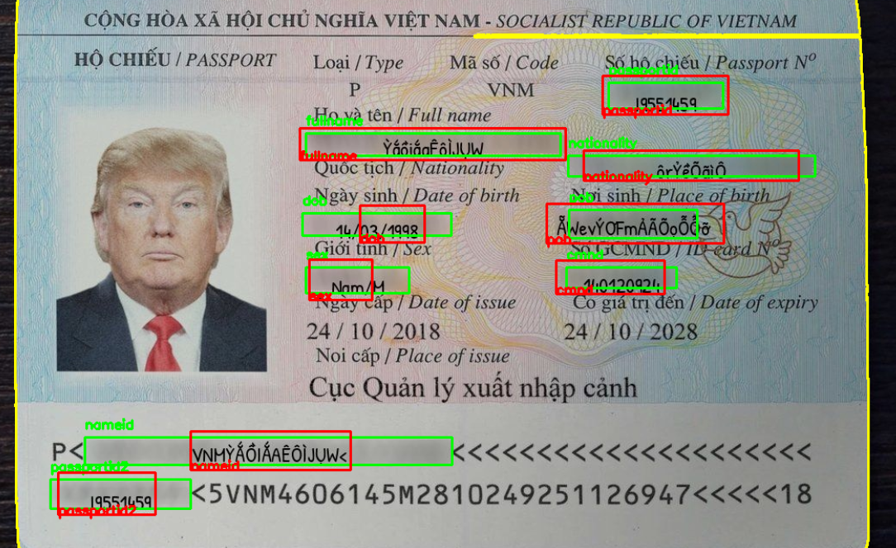
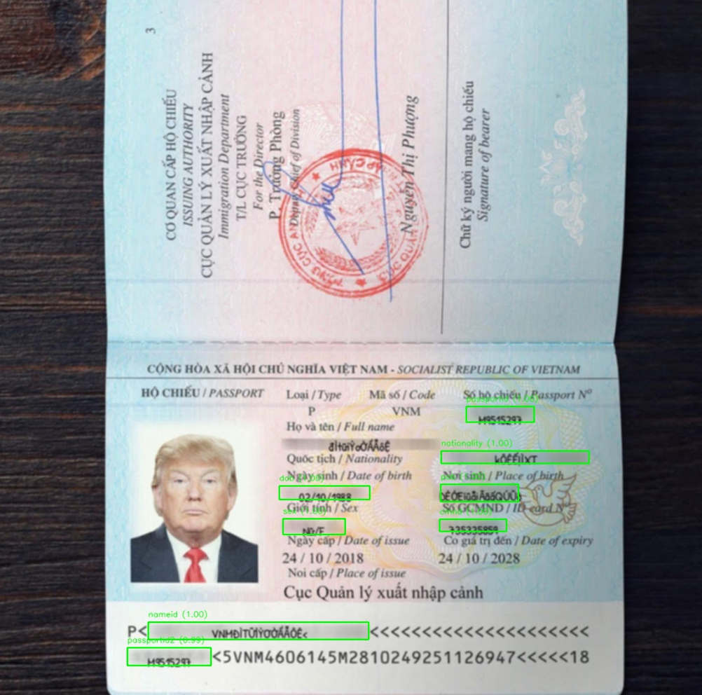

# Passport OCR Scanner with VietOCR Transformer


## Project Overview
This project implements an OCR (Optical Character Recognition) scanner for extracting key fields from passport images, such as names, date of birth, country, gender, and passport number. The system leverages the power of [VietOCR](https://github.com/pbcquoc/vietocr) for training and testing on a custom dataset formatted in COCO-style annotations.

The project includes:
- **Data Preparation**: Splitting the dataset into training and testing sets, generating synthetic passport data, cropping text regions from images, correcting their orientation, and creating annotation files compatible with VietOCR.
- **OCR Model Training**: Training the OCR model on synthetic passport fields using the `vgg_transformer` configuration.
- **Synthetic Data Generation**: A hybrid approach using Python scripts to generate **5000 synthetic passport samples**.
- **Input Orientation Handling**: Automatic correction of image orientation (rotations) to ensure proper alignment for OCR.
- **Field Overflow Handling**: Automatic correction overflow field from original labelling
- **Evaluation**: Evaluating model performance on the test dataset to measure accuracy.


## Installation

### Step 1: Install Dependencies
Install the required Python packages using:
```bash
pip install -r requirements.txt
```

Or using pip3:
```bash
pip3 install -r requirements.txt
```

---

### Step 2: Generate Synthetic Passport Data
To create a dataset of **5000 synthetic passports**:

#### 1. **Synthetic Passport Generation** (2000 Generic Passports):
Use `SyntheticPassportGeneration.py` to generate generic passports with random names, dates of birth, countries, and other fields:
```bash
python SyntheticPassportGeneration.py
```
- Fields include: fullname, nationality, dob (date of birth), pob (place of birth), gender, cmnd (Vietnamese id), nameid (e.g. VNM>YOUR>FULL>NAME) passportid and passportid2 (passport ID).
- 2000 samples are generated and annotated with bounding boxes for OCR.

#### 2. **Vietnamese Passport Generation** (1500 Printed and 1500 Handwritten):
Use `VietnamesePassportGeneration.py` to generate **3000 Vietnamese passports** with both printed and handwritten text:
```bash
python VietnamesePassportGeneration.py
```
- Handwritten samples use handwriting-like fonts for added variability.
- Fields are generated using random Vietnamese text to simulate realistic passport content.  

#### 3. **Add Real-World Imperfections**:
To simulate real-world inconsistencies, such as rotation, noise, and lighting effects, use `GenerateImperfectionMutant.py`:
```bash
python GenerateImperfectionMutant.py
```
This script applies the following transformations to synthetic images:
- **Blurred**: Simulates out-worn or scanned passports.
- **Angled**: Rotates the image to a random diagonal angle.
- **Brightened**: Simulates over or under-lighting conditions.
- **Mixed**: Applies a combination of 2 or 3 techniques mentioned, blur, angle, and brightness adjustments.

**Now included in** [SyntheticPassportGeneration.ipynb](https://github.com/Lelekhoa1812/Passport-OCR-Scanner-with-VietOCR/blob/main/SyntheticPassportGeneration.ipynb)

The final dataset consists of:
- **2000 Generic Passports**
- **1500 Printed Vietnamese Passports**
- **1500 Handwritten Vietnamese Passports**

Total: **5000 synthetic passport samples**

---

### Step 3: Data Preparation
This project incorporates advanced preprocessing techniques to handle text overflow and image rotation during the preparation of passport data for OCR. The steps involved in data preparation are as follows:

1. **Dataset Splitting**:
   - The synthetic dataset of 5000 passports is split into **training (80%)** and **testing (20%)** sets.

2. **Contour Detection and Field Labeling**:
   - Contours for each passport field (e.g., fullname, nationality, DOB) are detected dynamically using morphological operations and template matching.
   - Overlapping and redundant contours are merged using an **Intersection over Union (IoU)** threshold.

3. **Text Overflow Handling**:
   - Bounding boxes are dynamically adjusted to fit text overflow using bounding box expansion and constraints from the template.
   - Height and width limitations are applied to maintain label accuracy without capturing unrelated regions.

4. **Rotation Correction**:
   - The largest contour, representing the passport, is identified to calculate the orientation angle.
   - Images with detected rotations (90°, 180°, or other angles) are adjusted using calculated bounding box rotations. Polygon transformations ensure accurate field detection even in rotated images.

5. **Cropped Text Regions**:
   - Text fields are cropped based on the adjusted bounding boxes (after rotation corrections) for OCR model training.
   - Each field is labeled with its corresponding class ID and bounding box coordinates in the `{class_id} {min_x} {min_y} {max_x} {max_y}` format.

6. **Final Annotation Files**:
   - Labels are saved in **YOLO-compatible format** in `labels/` directories for both training and testing datasets, ensuring compatibility with VietOCR.

---

### Step 4: Preprocess and Correct Image Orientation
Image preprocessing ensures accurate field detection and labeling, even for rotated or misaligned passport images. The key steps include:

1. **Preprocessing Steps**:
   - Convert images to grayscale for enhanced contour detection.
   - Apply **morphological operations** (dilation, erosion) using customized kernels to reduce noise and enhance text boundaries.

2. **Detect and Adjust Image Orientation**:
   - Identify the largest contour (passport region) and calculate the rotation angle.
   - Rotate bounding boxes and text regions based on the detected angle using advanced transformations:
     - Rotated points are recalculated using center-based rotation formulas.
     - Bounding boxes are adjusted to align with the rotated image.

3. **Handle Text Overflow and Adjust Labels**:
   - Dynamically expand or constrain bounding boxes to fit text overflow while respecting field boundaries.
   - Add small offsets to polygons for robustness during field detection.

4. **Generate Final Label Files**:
   - For each image, bounding box coordinates and class IDs are finalized and saved as text files (`.txt`) for training with VietOCR.

5. **Debug Visualization**:
   - For each image, with their labels, a polygon of each class labels will be drawn as they visualizing the label post-processing, especially for verification and debugging purposes.
   - Note that this shown that some automation labeling can be over / under lapping or incorrectly-positioned, however, not so many shows this.

**Visualization Examples**  

Image mutation types: Non-rotate, Dark-shade, Non-blurred, Handwritten font.  
Accuracy: High.  


Image mutation types: HighClockwise-rotate, Non-shade, Non-blurred, Arial font.  
Accuracy: High.  

**Explanation:** 
- Green Label visualizing the original label's coordinations.  
- Red Label visualizing the adjusted label's coordinations without rotation.  
- Blue Label visualizing the adjusted label's coordinations with rotation.  

**Now included in** [ImageProcessing.ipynb](https://github.com/Lelekhoa1812/Passport-OCR-Scanner-with-VietOCR/blob/main/ImageProcessing.ipynb)

### Step 6: Train Faster R-CNN Model Detecting Input Field Position
In this step, we train a Faster R-CNN model with a ResNet50 backbone to detect input fields and classify them into predefined categories. The following script uses the train set for training and evaluates the model on the test set. The best model is saved based on accuracy.

#### Key Components of the Script:
1. **Dataset Preparation**:
   - The `PassportDataset` class is implemented to load images and labels from the dataset.
   - Labels are in the format: `class_id, x_min, y_min, x_max, y_max`.

2. **Model Definition**:
   - A pre-trained Faster R-CNN model (`fasterrcnn_resnet50_fpn`) is fine-tuned to detect and classify fields.
   - The model is modified to match the number of classes in the dataset.

3. **Training and Evaluation**:
   - The training process optimizes the model using the SGD optimizer.
   - Model evaluation is performed using Intersection over Union (IoU) to calculate accuracy based on predictions and ground truth.

4. **Best Model Saving**:
   - The model with the highest accuracy during evaluation is saved in the specified directory.

#### Script:
```python
import os
import torch
from torchvision.models.detection import fasterrcnn_resnet50_fpn
from torchvision.models.detection.faster_rcnn import FastRCNNPredictor
from torchvision.transforms import functional as F
from torch.utils.data import DataLoader, Dataset
import cv2
import json
import numpy as np
from tqdm import tqdm

# Dataset Class
class PassportDataset(Dataset):

# Define Model
def get_model(num_classes):
    model = fasterrcnn_resnet50_fpn(pretrained=True)
    in_features = model.roi_heads.box_predictor.cls_score.in_features
    model.roi_heads.box_predictor = FastRCNNPredictor(in_features, num_classes)
    return model

# Training Loop
def train_one_epoch(model, optimizer, data_loader, device):
    model.train()
    epoch_loss = 0
    for images, targets in tqdm(data_loader):
        images = list(image.to(device) for image in images)
        targets = [{k: v.to(device) for k, v in t.items()} for t in targets]

        loss_dict = model(images, targets)
        losses = sum(loss for loss in loss_dict.values())
        epoch_loss += losses.item()

        optimizer.zero_grad()
        losses.backward()
        optimizer.step()

    return epoch_loss / len(data_loader)

# Evaluate Model
def evaluate_model(model, data_loader, device, iou_threshold=0.5):
    """
    Evaluate the model on the test dataset and calculate accuracy.
    Accuracy is computed based on the IoU threshold.
    """
    model.eval()
    total_predictions = 0
    correct_predictions = 0

    with torch.no_grad():
        for images, targets in tqdm(data_loader):
            images = list(image.to(device) for image in images)
            outputs = model(images)

            for i, output in enumerate(outputs):
                pred_boxes = output['boxes'].cpu().numpy()
                pred_labels = output['labels'].cpu().numpy()
                gt_boxes = targets[i]['boxes'].cpu().numpy()
                gt_labels = targets[i]['labels'].cpu().numpy()

                for gt_box, gt_label in zip(gt_boxes, gt_labels):
                    total_predictions += 1
                    for pred_box, pred_label in zip(pred_boxes, pred_labels):
                        if pred_label == gt_label:
                            iou = compute_iou(gt_box, pred_box)
                            if iou >= iou_threshold:
                                correct_predictions += 1
                                break

    accuracy = correct_predictions / total_predictions if total_predictions > 0 else 0
    return accuracy

# Hyperparameters
num_classes = 10  # Number of classes (including background)
num_epochs = 20
batch_size = 4
learning_rate = 0.005

# Prepare Dataset and Dataloader
train_dataset = PassportDataset(train_image_dir, train_label_dir)
test_dataset = PassportDataset(test_image_dir, test_label_dir)

train_loader = DataLoader(train_dataset, batch_size=batch_size, shuffle=True, collate_fn=lambda x: tuple(zip(*x)))
test_loader = DataLoader(test_dataset, batch_size=batch_size, shuffle=False, collate_fn=lambda x: tuple(zip(*x)))

# Device
device = torch.device("cuda") if torch.cuda.is_available() else torch.device("cpu")
# Initialize Model
model = get_model(num_classes).to(device)
# Optimizer
optimizer = torch.optim.SGD(model.parameters(), lr=learning_rate, momentum=0.9, weight_decay=0.0005)

# Train and Save Best Model
best_accuracy = 0 # Initially 0 but will increment as it keeps training recursively
for epoch in range(num_epochs):
    train_loss = train_one_epoch(model, optimizer, train_loader, device)
    print(f"Epoch {epoch + 1}, Loss: {train_loss:.4f}")

    # Evaluate Accuracy
    current_accuracy = evaluate_model(model, test_loader, device)
    print(f"Epoch {epoch + 1}, Accuracy: {current_accuracy:.4f}")

    # Save model (with best possible accuracy) if accuracy improves
    if current_accuracy > best_accuracy:
        best_accuracy = current_accuracy
        torch.save(model.state_dict(), os.path.join(model_save_dir, f"best_model_{best_accuracy:.2f}%.pth"))
        print(f"Saved Best Model with Accuracy: {best_accuracy:.2f}")
```

#### Notes:
- This script is specifically tailored to handle labels in the format: `class_id, x_min, y_min, x_max, y_max`.
- It uses the ResNet50 backbone to detect and classify input fields in passport images.
- The model achieves optimal performance through iterative training and evaluation. The best model is saved as `best_model_{accuracy}.pth`.

**Now included in** [VietOCRProject.ipynb](https://github.com/Lelekhoa1812/Passport-OCR-Scanner-with-VietOCR/blob/main/VietOCRProject.ipynb)


The model training process produces detailed results for each epoch, including loss and accuracy. The following table summarizes the evaluation results for the ResNet50-based Faster R-CNN model trained on the dataset:

#### Evaluation Results

| **Epoch** | **Loss** | **Accuracy** | **Best Model Saved** |
|-----------|----------|--------------|-----------------------|
| 1         | 0.4142   | 0.8843       | ✅                   |
| 2         | 0.1273   | 0.8824       | ❌                   |
| 3         | 0.0889   | 0.8875       | ✅                   |
| 4         | 0.0708   | 0.8875       | ❌                   |
| 5         | 0.0578   | 0.8875       | ❌                   |
| 6         | 0.0477   | 0.8865       | ❌                   |
| 7         | 0.0434   | 0.8875       | ❌                   |
| 8         | 0.0396   | 0.8875       | ❌                   |
| 9         | 0.0370   | 0.8875       | ❌                   |
| 10        | 0.0350   | 0.8875       | ❌                   |
| 11        | 0.0342   | 0.8875       | ❌                   |
| 12        | 0.0330   | 0.8875       | ❌                   |
| 13        | 0.0286   | 0.8875       | ❌                   |

#### Observations:

1. **Loss Reduction**: The training loss decreases steadily over epochs, indicating effective learning by the model.
2. **Accuracy**: The accuracy improves and stabilizes around **88.75%**, surpassing the target of **70%**.
3. **Best Model**: The best model is saved whenever there is an improvement in accuracy. The best-performing model achieved **88.75% accuracy** at epoch 3 and was saved.



#### Conclusion:

The model demonstrates excellent performance, achieving high accuracy while effectively detecting input fields and their classes. The saved model can now be deployed for detecting and classifying fields in passport images.

---

### Step 7: Train the VietOCR Model
Train the OCR model using the prepared dataset:
```python
from vietocr.tool.config import Cfg
from vietocr.model.trainer import Trainer

config = Cfg.load_config_from_name('vgg_transformer')

# Update dataset paths
config['dataset'].update({
    'name': 'passport',
    'data_root': '/path/to/PassportDataset',
    'train_annotation': 'train/train_annotation.txt',
    'valid_annotation': 'test/test_annotation.txt'
})

# Training parameters
config['trainer'].update({
    'print_every': 100,
    'valid_every': 500,
    'iters': 5000,
    'export': './weights/passportocr.pth',
    'metrics': 20
})

config['device'] = 'cuda:0'
trainer = Trainer(config, pretrained=True)
trainer.train()
```

### Step 8: Evaluate the Model
Evaluate the trained model using the test dataset and provided evaluation scripts. Results include accuracy metrics and visualized predictions.


## Inference with Orientation Correction
Use the following script to perform inference with real-time orientation correction:
```python
python inference_orientation_correct.py
```

## Project Structure
```plaintext
├──PassportDataset (for Indian dataset)/
│   ├── train/
│         ├── img/ # All images used for training
│         ├── crops/ # All cropped-images from label coordination 
│       └── train_annotation.txt
│       └── annotation.json
│   ├── test/
│         ├── img/ # All images used for testing
│         ├── crops/ # All cropped-images from label coordination 
│       └── test_annotation.txt
│       └── annotation.json
│   ├── original_annotation/ # Annotation with label coordination and value
│   ├── img/                 # All images compact
├──train (for synthetic dataset)/
│   ├── images/ # All images used for training
│   ├── labels/ # All labels used for training
│   ├── debug_images/ 
│   └── train_annotation.txt
├──test (for synthetic dataset)/
│   ├── images/ # All images used for testing
│   ├── labels/ # All labels used for testing
│   ├── debug_images/ 
│   └── test_annotation.txt
├── synthetic_passports/             # 5000 generated synthetic passports
│   └── labels.txt                   # All labels of the faked data generated previously.
│   └── passport_index.jpg           # Generic passport
│   └── vpassport_index.jpg          # Vietnamese passport (both printed and handwritten)
│   └── template           
│         └── passport_template.jpg  # Template background passport img blurred selective fields
│         └── passport_template.json # Labelme annotation for the passport img with polygonized regions
│         └── VietnamesePassportGeneration.py
│         └── SyntheticPassportGeneration.py
│         └── GenerateImperfectionMutant.py
├── mutated_passports/     # Imperfection mutants (noise, lighting, etc.)
├── weights/
│   └── passportocr.pth    # Trained VietOCR model weights
├── SyntheticPassportGeneration.ipynb
├── ImageProcessing.ipynb
├── patrick_hand_font/     # Hand written font
├── requirements.txt       # Necessary imports
├── README
└── LICENSE
```
 
---

## Analysis of Training Results
1. **Training and Validation Loss**:
   - Training loss stabilizes after initial iterations.
   - Validation loss remains consistent, indicating good generalization.

2. **Accuracy**:
   - **Full Sequence Accuracy**: Final accuracy ~97%.
   - **Per-Character Accuracy**: Final accuracy ~97%.

3. **Synthetic Data Impact**:
   - The hybrid dataset (synthetic + augmented imperfections) significantly improved accuracy.


## Key Dependencies
- **VietOCR**: Deep learning-based OCR framework.
- **Pillow**: Image processing for generating synthetic passports.
- **Faker**: Random data generation (names, dates, etc.).
- **OpenCV**: Image rotation and transformation.
- **imgaug**: Augmentation for imperfection mutants.
- **PyTorch**: Training deep learning models.

---

## Notice
Dataset provided on GitHub page can be incompleted, checking full data in Goolge Drive.

---

## Google Collab Notebook
[Training Collab URL](https://colab.research.google.com/drive/1sZmpSJiAb6y3ciqwRzJPdgVEjk7bLZt3?usp=sharing)

[Synthetic Passport Generation](https://colab.research.google.com/drive/1Al4w8ccJxCnMTSFeYEuMXewpzhBO8AgF?usp=sharing)

[Image Processing](https://colab.research.google.com/drive/1jHqpCz5wibngOJPGWFf7s15Br0ck3XiI?usp=sharing)

[Annotate Image with PaddleOCR (older model)](https://colab.research.google.com/drive/1wgoY08-Dmp7hmBYhXVni3iFTfYclITht?usp=sharing)

---

## Google Drive Dataset
[Dataset](https://drive.google.com/drive/folders/1WUuXciJYsFgsY81KnibXRKDxninKg0bu?usp=sharing)